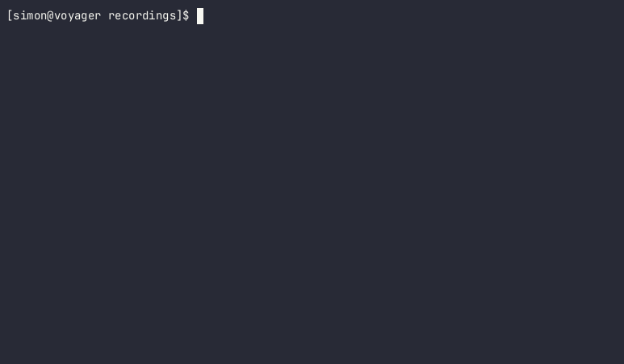

# NeoNote

NeoNote is a terminal app to manage your notes. NeoNote stores your notes for you and provides filtering and searching options to find them easily.



## Features

- Create/Edit/Delete Notes
- Parses tags directly from your note
- Filter notes based on tag and creation/modification date
- Fuzzy search notes incrementally

## Installation

### Binary files

You can find builds for linux x86 in the [releases section](https://github.com/Simre1/neonote/releases).

### Build from source

NeoNote is built with the Haskell build tool `cabal`. You'll need it along with a recent Haskell compiler.

To build from source, run:
```bash
cabal build all
````

Then, you will find the executable inside the `dist-newstyle` folder.

## Get Started

Take a look at the NeoNote help menu to get a quick overview of the commands and to explore the various options.
Each command can be shortened to one letter, eg. `nn c` instead of `nn create`.

### Create a note

```
nn create
```

An editor will open where you can write your note.
Tags will be automatically found when you use the `#` symbol within a note.
You can also start composing your note directly in the terminal by just typing the text:
```bash
nn c "Your first note with #neonote"
```

### Using the note picker

To review already existing notes, you will normally use the picker UI. It can be opened with the following command:

```
nn pick
```

Within this UI, you can incrementally search through your notes. It is possible to edit with `ENTER`, delete with `CTRL-X` and view with `CTRL-Y`.
You can also apply a filter before picking from your notes with the `--filter` option.

### Processing notes without the picker

```
nn edit
```

`edit` will directly open your editor with all matched notes.
Per default, it will only match `1` note with no searching or filtering.
This means it will open the note which was last modified. 

You can specify a filter, a search term and the amount of notes to match. The following command
will open at most 3 notes with the tag `#neonote` and the word `todo`.
```
nn edit --filter neonote --number 3 todo 
```

Similarly to the `edit` command, there exist `delete` and `view` commands to delete and view multiple notes.

This will delete up to a hundred notes with the tag `#archived`.
```
nn delete --filter archived --number 100
```

This will view up to 10 notes with the word linux
```
nn view --number 10 linux
```

### List notes

The `list` command gives you an overview of your notes by printing them in a table and giving you information about their
modification date or their tags.

```
nn list
```

Per default, the modification date, the tags and a preview of the content is shown.
You can change which attributes of the note are shown with `--attribute` (`-a` for short):

```
nn list --attribute id --attribute created
```

Now, `id` and `created` will be shown instead of the default `modified` and `tags`.
The content preview will always be shown regardless of given attributes.

Of course, you can combine this normal filtering and searching. The following
command will list up to 5 notes with the `#blog` tag and the word haskell. 
```
nn l --filter blog --number 5 haskell
```

## Tags

You can add a tag to your notes simply by writing `#your-tag` somewhere within the note.
Currently, tags may consist of english characters as well as `-` (no numbers!).

## Filter notes

You can filter before searching with the `--filter` argument.

```
nn view --filter "programming"
```

This will only allow you to pick between notes which have the tag `programming`.
This can also be used with `delete`, `edit` and `list`.

### Boolean logic for filtering

- `*` matches every note
- `a & b` matches if both `a` and `b` match
- `a | b` matches if either `a` or `b` matches
- `~ a` matches if `a` does not match
- Use brackets (`(a)`) to group expressions

```
nn view --filter "*" # matches everything
nn view --filter "programming & ~html" # matches notes with the tag programming but not the tag html
nn view --filter "programming | coding" # matches notes with either the tag programming or the tag coding
nn view --filter "(programming | coding) & ~html" # combine expressions with brackets
```

### Date filters

In addition to filtering for tags, you can also filter based on the creation and modification date of a note.

- `>`, `<`, `=` operators for dates
- `created` and `modified` literal to access the date of a note
- `YYYY-MM-DD` for day literals
- `HH-MM-SS` for time literals

```
nn view --filter "created = 2023-07-01" # matches all notes created on 2023-07-01
nn view --filter "modified = 2023-07-01" # matches all notes modified on 2023-07-01
nn view --filter "modified > 2023-07-01" # matches all notes modified after 2023-07-01
nn view --filter "modified < 2023-07-01" # matches all notes modified before 2023-07-01
nn view --filter "modified > 2023-05-30 & modified < 2023-07-01" # matches all notes modified in June 2023
nn view --filter "modified > 2023-07-01 & programming" # matches all notes modified after 2023-07-01 with the tag programming
nn view --filter "modified > 10:30:00" # matches all notes modified after 10:30:00
```

In the future, less restrictive date specifications will be possible.
For example, you could apply the filter `modified = July` or `created = around 10am`.

## Configuration

You have two options to specify configurations:

- `config.ini` within the xdg config directory which will be created on the first neonote execution
- environment variables (`NEONOTE_PATH`, `NEONOTE_EDITOR`, `NEONOTE_EXTENSION`)

### Default note location

Per default, neonote stores notes as `md` (Markdown) files in a folder `neonote` in the XDG data directory (`.local/share/neonote` on Linux).  

### Possible Editors

You can choose any editor you want by specifying it in the configuration.
However, you need to make sure that the editor blocks until the editing process is finished and that it can open multiple files simultanously.

If your editor command has a `%`, it will be replaced with the files to edit separated by a ` `.
If it does not have a `%`, the files are appended at the end of your command.

Here are some example editor configurations:
- Vim: `vim` or `vim %`
- Helix: `helix` or `helix %`
- Nano: `nano` or `nano %`
- VSCode: `code --wait` or `code --wait %`
- VSCodium: `codium --wait` or `code --wait %`